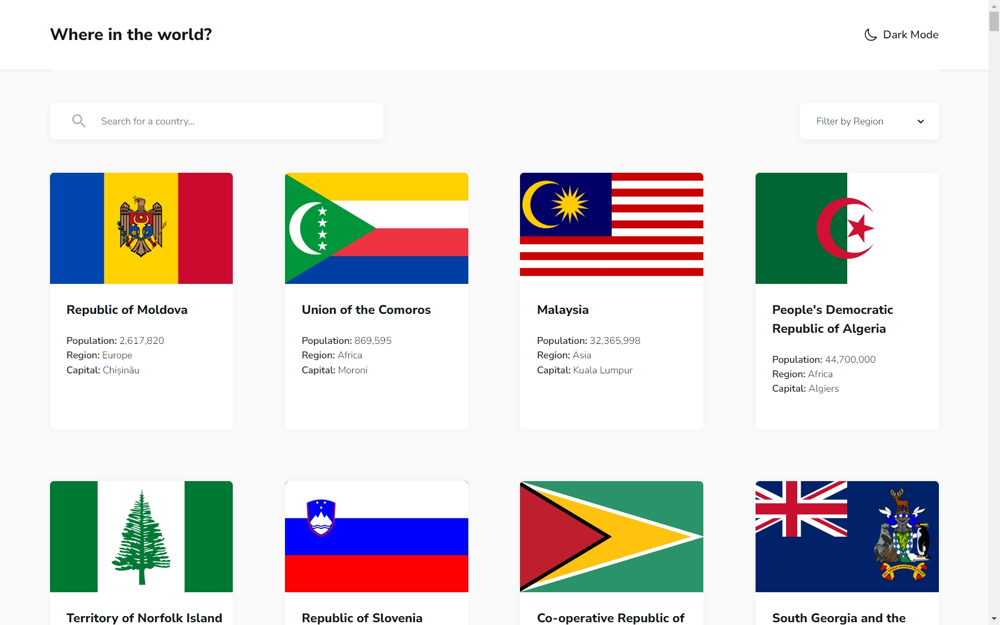

# Frontend Mentor - REST Countries API with color theme switcher solution

This is a solution to the [REST Countries API with color theme switcher challenge on Frontend Mentor](https://www.frontendmentor.io/challenges/rest-countries-api-with-color-theme-switcher-5cacc469fec04111f7b848ca).

## Table of contents

- [Overview](#overview)
  - [The challenge](#the-challenge)
  - [Screenshot](#screenshot)
  - [Links](#links)
- [My process](#my-process)
  - [Built with](#built-with)
  - [What I learned](#what-i-learned)
- [Author](#author)

## Overview

### The challenge

Users should be able to:

- See all countries from the API on the homepage
- Search for a country using an `input` field
- Filter countries by region
- Click on a country to see more detailed information on a separate page
- Click through to the border countries on the detail page
- Toggle the color scheme between light and dark mode _(optional)_

### Screenshot

### Links

- Solution URL: [GitHub](https://github.com/kaamiik/fm-rest-countries-api-using-next-ts-tailwind)
- Live Site URL: [Vercel](https://fm-rest-countries-api-using-next-ts.vercel.app/)

## My process

### Built with

- Semantic HTML5 markup
- CSS (Tailwind, FlexBox, Grid)
- Mobile-first workflow
- [React](https://reactjs.org/) - JS library
- [Next.js](https://nextjs.org/) - React framework
- TypeScript

### What I learned

- **Server Components**: Leveraged server-side rendering for optimal performance

- **Caching Strategies**: Used `unstable_cache` for API response caching with proper revalidation

- **Dynamic Routes**: Created dynamic country detail pages with proper error handling

- **Optimistic Updates**: Implemented `useOptimistic` for smooth user interactions during search/filtering

- **Suspense Integration**: Used React Suspense for loading states with fallback components

## Author

- Frontend Mentor - [@kaamiik](https://www.frontendmentor.io/profile/kaamiik)
- X - [@kiaakamran](https://www.x.com/kiaakamran)
